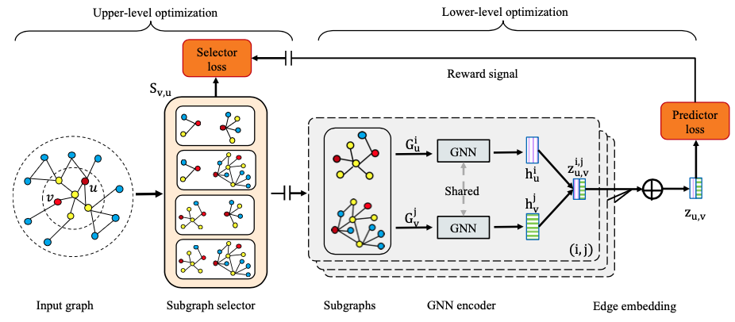
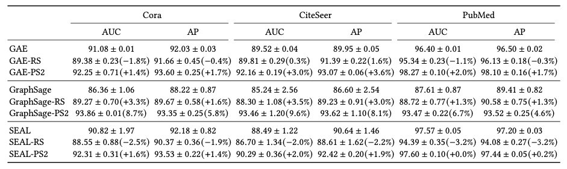
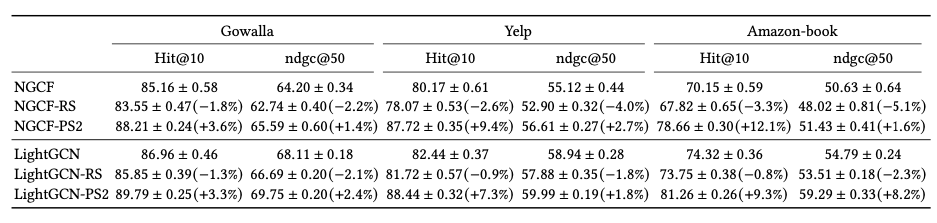

<p>
	
	<br>
</p>

<h1> PS2: Graph Neural Networks for Link Prediction with Personalized Subgraph Prediction</h1>

This is a pytorch and pytorch-geometric based implementation for WSDM'23 paper [Bring Your Own View: Graph Neural Networks for Link Prediction with Personalized Subgraph Selection](https://arxiv.org/pdf/2212.12488.pdf) 

Graph neural networks (GNN) is the state-of-the-art methods for link prediction (GNNLP). However, existing GNNLP methods significantly rely on the ad-hoc subgraph, i.e., the optimal number of neighborhood hops for two end nodes. PS2 is an automated subgraph selection framework, which works as a plug-and-play method to automatically, personally, and inductively identify optimal subgraphs for different edges when performing GNNLP. Coulping GNNLP with PS2, we suggest a brand-new angle towards GNNLP training: by first identifying the optimal subgraphs for edges; and then focusing on training the inference model by using the sampled subgraphs. Comprehensive experiments endorse the effectiveness of our proposed method across various GNNLP backbones (GCN, GraphSage, NGCF, LightGCN, and SEAL) and diverse benchmarks (Planetoid, OGB, and Recommendation datasets).

<h2>Installation</h2>

The required packages can be installed by running 
```
pip install -r requirements.txt
```

<h2>Datasets</h2>

The datasets used in our paper can be automatically downlowad. 

<h2> Quick Start</h2>

You could try on the Planetoid datasets (Cora, CiteSeer, and Pubmed):

```
python ps2_planetoid.py --dataset "Cora" 
```

<h2> Experimental Results</h2>

Link prediction results on homogeneous graph

<p>
	
	<br>
</p>


Link prediction results on recommendation datasets

<p>
	
	<br>
</p>

<h1>Citing</h1>

If you find this work is helpful to your research, please consider citing our paper:

```
@article{tan2022bring,
  title={Bring Your Own View: Graph Neural Networks for Link Prediction with Personalized Subgraph Selection},
  author={Tan, Qiaoyu and Zhang, Xin and Liu, Ninghao and Zha, Daochen and Li, Li and Chen, Rui and Choi, Soo-Hyun and Hu, Xia},
  journal={arXiv preprint arXiv:2212.12488},
  year={2022}
}
```
